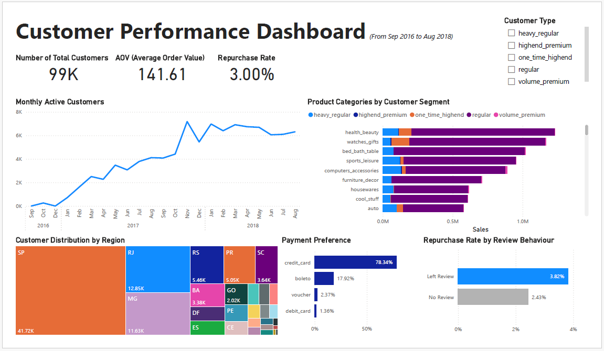

# Behavioral Analytics Across Users on Olist E-Commerce Platform

## 📑 Table of Contents
- [Summary](#summary)
- [Problem Statement](#problem-statement)
- [Tools Used](#tools-used)
- [About Business](#about-business)
- [About Dataset](#about-dataset)
- [Audience](#audience)
- [Working Process](#working-process)
- [User Segmentation](#user-segmentation)
- [KPI Definition](#kpi-definition)
- [Findings](#findings)
- [Actionable Suggestions](#actionable-suggestions)
- [Conclusion](#conclusion)

---

## Summary
This project analyzes user behavior on the Olist e-commerce platform by segmenting both customers and sellers, calculating key performance indicators (KPIs), and uncovering actionable insights to address major business challenges. Using SQL, Python, and Power BI, the analysis identifies low repurchase rates, high seller dormancy, and category performance imbalances as core issues. Through a structured data-driven approach, the report proposes targeted CRM and marketing strategies such as review-triggered loyalty campaigns and seller reactivation programs to enhance retention, drive sales, and optimize platform efficiency.

---

## Problem Statement
This project’s problem statement focuses on **analyzing the behavioral patterns** of Olist’s **core users (customers and sellers)** and segmenting them in a meaningful way. Furthermore, it aims to identify actionable insights that support long-term platform growth by enhancing seller engagement, increasing customer retention, and optimizing product variety to meet both supply and demand effectively.

- Who are the customers and sellers?
- How are their behaviors?
- How can we increase the number of active sellers on the platform?
- How can we increase sellers' consistent activity and customer retention?
- How can we help sellers increase their sales performance?
- How can we ensure product variety that benefits both sellers and customers, without pushing products that don’t sell?

---

## Tools Used
- **MySQL** – Main tool for data wrangling, exploratory analysis, and KPI calculation  
- **Python (Pandas, Matplotlib, Seaborn)** – Used for initial data understanding and visual exploration (e.g., missing values, distribution plots, correlation heatmap)  
- **Power BI** – Used for interactive dashboard development and presenting key insights

---

## About Business
Olist is a Brazilian e-commerce platform that connects small and medium-sized sellers to major online marketplaces, such as Mercado Livre, B2W, and others. By offering a unified storefront and operational support, including logistics, payments, and customer service, Olist lowers the entry barrier for local merchants and helps them scale efficiently. Rather than selling products directly, Olist operates as a marketplace enabler, earning revenue through commissions, seller subscription fees, and service fees on each transaction. Its business model thrives on the success of its sellers, making platform growth and seller performance critical to its profitability. This dual-sided ecosystem, which contains buyers and sellers, forms the foundation of Olist’s value proposition in the competitive e-commerce landscape.

---

## About Dataset
This **real-world dataset**, collected from a large-scale e-commerce platform between 2016 and 2018, contains over 100,000 orders and provides rich insights into consumer behavior, seller performance, and operational dynamics. It serves as a strong foundation for behavioral analytics, user segmentation, and performance benchmarking on a dual-sided marketplace.

👉 [Original dataset on Kaggle](https://www.kaggle.com/datasets/olistbr/brazilian-ecommerce)

Unused tables such as geolocation were excluded for clarity. The product_category_name_translation table was not used as a separate entity, but its data was fully merged into the products table to include English category names.
Additionally, the order_reviews table was cleaned to remove duplicated or incomplete entries, and its primary key was redefined from a composite of review_id and order_id to a single unique key: review_id.

---

## Audience
This analysis is primarily intended for the **Marketing and Customer Relationship Management (CRM) teams** at Olist.

By uncovering behavioral patterns across customers and sellers, the project offers actionable insights that can support strategic decision-making in areas such as:

- Targeted marketing campaigns
- Customer segmentation and retention strategies
- Seller engagement and activity management
- Product category optimization

---

## Working Process
This project followed a structured approach to explore, clean, and analyze the Brazilian e-commerce dataset from Olist. The overall process was divided into four major phases:

**1. Data Understanding**
I began by examining the nine tables provided, analyzing their relationships and business context. An Entity-Relationship Diagram (ERD) was created to visualize key connections among orders, customers, sellers, products, and payments. This helped clarify how each user group (customers and sellers) interacts with the platform and with each other.

**2. Exploratory Data Analysis (EDA)**
Using Python (Pandas, Matplotlib, Seaborn) and MySQL, I conducted an **in-depth analysis of trends** such as sales distribution over time, popular product categories, and payment behavior. EDA also helped in identifying patterns and potential segmentation opportunities across both sellers and customers.

**3. Data Wrangling**
To ensure data reliability and consistency, I performed various cleaning steps such as **handling missing values, removing time-sequence anomalies and records violating business logic, merging related tables, and standardizing product categories**. This stage was critical to prepare the data for accurate KPI calculations and further analysis.

👉 [View notebooks here](https://github.com/ichbinhyun/olist-behavioral-analytics/tree/main)

Each of these steps laid the foundation for defining KPIs, deriving behavioral insights, and formulating actionable recommendations for both customer engagement and seller performance enhancement.

---

## User Segmentation
### 1. Customer Segmentation
Customers were segmented into six distinct groups using rule-based thresholds derived from the data. The segmentation criteria considered **order frequency, total spending, average order value (AOV), and purchasing concentration toward high-performing sellers**. These indicators were selected to reflect purchasing power, loyalty, and product affinity.

| Segment Name         | Criteria                                                                                       | Reasoning                                                                                                           |
|----------------------|------------------------------------------------------------------------------------------------|---------------------------------------------------------------------------------------------------------------------|
| **High-End Premium**     | ≥ 2 purchases, ≥ $1000 total spend, AOV ≥ $251.68, ≥ 70% from purchases from premium sellers   | Represents loyal and high-spending customers who prefer premium-quality products and consistently shop from top-tier sellers. |
| **Volume Premium**       | ≥ 2 purchases, ≥ $700 total spend, lower AOV or < 70% from premium seller purchases            | Frequent buyers with considerable spending, but less focus on premium sellers or high-end items.                   |
| **Heavy Regular**        | ≥ 5 purchases or ≥ $500 spend, < 30% from premium seller purchases                             | Highly active customers, but mainly engaged with general or budget sellers — possibly deal-seekers.               |
| **One-Time High-End**    | 1 purchase, ≥ $1000 spend, AOV ≥ $251.68, ≥ 70% premium seller purchases                       | First-time buyers with high-value transactions; potential for conversion into loyal high-end customers.           |
| **Regular**              | Everyone else not matching the above segments                                                  | General customer base with varied but less consistent or high-value behavior.                                      |

The thresholds (e.g., AOV = $251.68) were based on statistical benchmarks such as the average AOV (×2), total spend percentiles, and purchase distribution across premium vs. general sellers

### 2. Seller Segmentation
Sellers were categorized into three groups based on their total sales performance and average order value. **The top 5% of sellers by total sales** were first identified, then further **divided by their average order value** to distinguish between **high-end and volume-based business strategies**.

| Segment Name       | Criteria                                                                 | Reasoning                                                                                                         |
|--------------------|--------------------------------------------------------------------------|-------------------------------------------------------------------------------------------------------------------|
| **High-End Premium**   | Among top 5% sellers by total sales; upper half by average order value   | Sellers who generate large revenue through high-ticket items, often targeting niche, premium markets.            |
| **Volume Premium**     | Among top 5% sellers by total sales; lower half by average order value   | Sellers who rely on high volume and lower-priced products to drive performance.                                  |
| **Regular**            | All other sellers not in the top 5%                                      | Standard performance group, including newer sellers, niche product sellers, or less active ones.                  |

This seller segmentation helps uncover how different seller types contribute to platform revenue and allows the company to tailor support, promotions, or recommendations accordingly.

---

## KPI Definition
To evaluate user behavior and platform performance, I established a set of Key Performance Indicators (KPIs) aligned with the problem statements. These KPIs are categorized into three areas: **Sales, Sellers, and Customers.**
Each metric was designed to offer actionable insights for platform growth, user engagement, and business optimization.

### Sales KPIs
| KPI Name                         | Description                                                                 |
|----------------------------------|-----------------------------------------------------------------------------|
| **Average Order Value (AOV)**        | Measures the average amount spent per order, indicating revenue efficiency.|
| **Order Fulfillment Rate**           | Share of delivered orders among all orders, measuring operational reliability.|
| **Number of Sold Products**          | Total number of product units sold across the platform.                    |
| **Total Sales by Year & Region**     | Revenue distribution over time and across geographies.                     |
| **Growth Rate of Product Categories**| Changes between the latest 3 months and the previous 3 months in sales volume by category. |
| **Sales Trend per Category**         | Time-series performance of each product category.                          |
| **Annual Sales Trend**               | Macro-level revenue trend across all products and sellers.                 |

### Seller KPIs
| KPI Name                          | Description                                                                 |
|-----------------------------------|-----------------------------------------------------------------------------|
| **Total Number of Sellers**           | Platform-wide seller count.                                                |
| **Average Order Value (Seller-Level)**| Average revenue per order by seller.                                       |
| **Product Category Breadth**          | Number of unique product categories sold by each seller.                   |
| **Seller Distribution by Region**     | Geographic breakdown of active sellers.                                    |
| **Top Product Category per Seller**   | Most sold product category per seller.                                     |
| **Dormant Seller Rate**               | Proportion of sellers who haven’t made sales in the recent months.        |
| **Consistent Selling Rate**           | Share of sellers with monthly activity in at least 9 of the past 12 months.|

### Customer KPIs
| KPI Name                                 | Description                                                                  |
|------------------------------------------|------------------------------------------------------------------------------|
| **Total Number of Customers**                | Count of unique customers across the platform.                              |
| **Average Order Value (Customer-Level)**     | Average spend per order per customer.                                       |
| **Repurchase Rate**                          | Share of customers who placed more than one order.                          |
| **Active Customers Over Time**               | Trend of customers making purchases each year.                              |
| **Category Preference**                      | Top product categories by customer segment.                                 |
| **Customer Distribution by Region**          | Geographic breakdown of customer base.                                      |
| **Payment Preference**                       | Most used payment methods across customers.                                 |
| **Repurchase Rate by Review Behavior**       | Correlation between review scores and repeat purchase likelihood.           |

These KPIs provided a structured foundation for discovering trends, identifying pain points, and developing data-driven recommendations tailored to Olist’s dual-sided platform model.

---

## Findings
  
  

👉 [View interactive dashboards here](https://app.powerbi.com/) 

1. Sales Performance: How do we increase sales and ensure product variety?
•	Between Sep 2016 and Aug 2018, the platform recorded a total of R$15.4M in sales across 113K products, with a solid AOV (Average Order Value) of R$159.85 and an outstanding Order Fulfillment Rate of 97.02%.
•	The most significant sales spike occurred in November 2017, where monthly sales exceeded R$1M for the first time, clearly indicating the impact of Black Friday campaigns.
•	Sales were geographically concentrated, with São Paulo (CE) alone generating over R$266K, followed by Pernambuco (PE) (R$212K) and Paraná (PR) (R$181K).
•	The platform supports a diverse product catalog (74 categories), and top categories such as Health & Beauty, Watches & Gifts, and Bed & Bath consistently outperformed others.
•	Category-level growth (e.g., Telephony from 57.93K → 63.07K) shows healthy consumer demand diversification, supporting product variety without relying on underperforming items.

✅ Insight:
A clear sales peak aligns with known seasonal patterns (e.g., Black Friday), emphasizing the importance of campaign-driven traffic.
Additionally, maintaining high-performing categories while filtering low-ROI inventory supports a balanced product strategy.

2. Seller Analysis: How can we support sellers to stay active and sell consistently?
•	The marketplace consisted of 3,095 active sellers, classified into regular, volume_premium, and highend_premium types.
•	Volume_premium sellers had the most reliable performance:
  o	Consistent selling rate: 98.70%
  o	Dormancy rate: only 3.9%
  o	High presence in fast-moving categories like Bed & Bath and Sports & Leisure
•	Highend_premium sellers specialized in Furniture & Decor, with AOV above R$250, but showed slightly lower consistency (86.84%) and 13.16% dormancy rate, potentially due to niche product cycles.
•	In contrast, regular sellers suffered from both low consistency (27.37%) and high dormancy (32.59%), suggesting lack of engagement or operational capacity.
•	Seller distribution was heavily centralized in SP, indicating a potential need to diversify supply-side participation across regions.

✅ Insight:
Consistent and active sellers are clearly concentrated in premium segments. Support programs (incentives, logistics, visibility) should prioritize regular sellers to reduce dormancy and increase platform reliability.

3. Customer Behavior: Who are the customers, and how can we improve retention?
•	The platform attracted 99K unique customers, mostly from SP (41.7K), RJ (12.8K), and MG (11.6K).
•	Average order value per customer was R$141.61, slightly below the global AOV.
•	Only 3.00% of customers repurchased, showing weak retention.
  o	However, users who left a review had a 57% higher repurchase rate (3.82% vs 2.43%) — signaling that engagement through feedback loops impacts loyalty.
•	Customers were segmented into five types:
  o	heavy_regular, volume_premium, highend_premium, one_time_highend, and regular
•	Premium segments leaned toward high-end categories like Health & Beauty, Watches, and Decor, while regular customers had broader distribution across products.
•	Monthly active users steadily increased from <1K in late 2016 to ~6K in early 2018, indicating organic platform growth.

✅ Insight:
Retention is a core challenge. Integrating incentives for feedback, loyalty campaigns, and personalizing product recommendations based on past behavior could significantly improve repurchase behavior — especially for regular or dormant users.

---

## Actionable Suggestions
1. Boost Repurchase via Review-Based Loyalty Campaigns
Why it’s #1: Directly solves low retention (3%) and is super low-cost to implement via CRM.
•	Customers who left a review were 57% more likely to return.
•	Run a “Review & Save” email campaign: small voucher or discount for those who leave feedback.
•	Automate this in CRM flows post-delivery.
👉 Impact: Increases both retention and review volume without increasing CAC.
________________________________________
2. Reactivate Dormant Sellers with Incentivized Re-entry
Why it’s #2: 1/3 of regular sellers are dormant. They're already onboarded = cheap win.
•	32.59% dormancy rate among regular sellers.
•	Launch a reactivation program:
o	30-day zero commission
o	dashboard badge (e.g., “Returning Seller”)
o	email nudges via seller CRM
👉 Impact: Converts silent sellers into active inventory without new seller acquisition cost.
________________________________________
 3. Leverage Seasonal Trends like Black Friday with Targeted Category Promotions
Why it’s #3: The highest platform sales ever (R$1M+) came from November 2017 = proven ROI.
•	Focus Q4 campaigns on top-converting categories (e.g., Health & Beauty, Watches & Gifts).
•	Build seasonal landing pages, bundles, or curated picks with seller co-promotion.
👉 Impact: Drives predictable sales spikes with minimal trial-and-error.

---

## Conclusion
This project applied behavioral analytics to a real-world e-commerce dataset to uncover key insights around customer retention, seller performance, and sales dynamics. By aligning data-driven segmentation and KPIs with targeted business actions, the analysis provides a practical roadmap for improving engagement and growth on a dual-sided marketplace like Olist.
